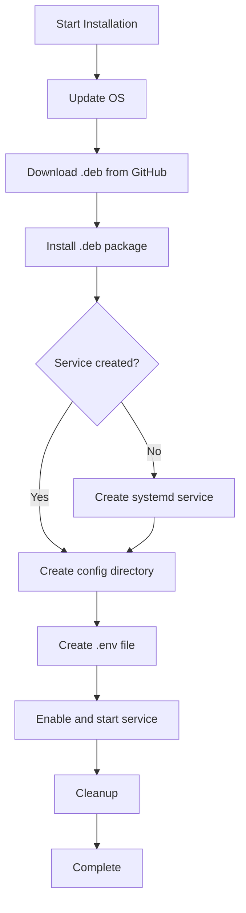

# Lemonade Server Script Plan

## Overview

This plan outlines the creation of ProxmoxVED scripts for **lemonade-server**, a lightweight LLM inference server with OpenAI-compatible APIs.

## Project Information

| Property | Value |
|----------|-------|
| **Name** | Lemonade Server |
| **GitHub** | https://github.com/lemonade-sdk/lemonade |
| **Documentation** | https://lemonade-server.ai/docs/server/server_integration/ |
| **Category** | AI / Coding & Dev-Tools (20) |
| **Port** | 8000 |
| **Type** | LLM Inference Server |

## Installation Method

The application is distributed as a Debian package (`.deb`) from GitHub releases:

```bash
wget https://github.com/lemonade-sdk/lemonade/releases/latest/download/lemonade-server_9.4.1_amd64.deb
sudo apt install ./lemonade-server_9.4.1_amd64.deb
```

### Key Observations

1. **Binary Distribution**: Uses `.deb` package - will use `fetch_and_deploy_gh_release` with `"binary"` mode
2. **Version Pattern**: `lemonade-server_X.X.X_amd64.deb` - need to fetch latest version dynamically
3. **Systemd Service**: The `.deb` package likely creates a systemd service automatically
4. **Configuration**: Environment variables in `/opt/lemonade/.env` or similar

## Files to Create

### 1. CT Script: `ct/lemonade.sh`

```bash
#!/usr/bin/env bash
source <(curl -sSL https://raw.githubusercontent.com/community-scripts/ProxmoxVED/main/misc/build.func)
# Copyright (c) 2021-2026 community-scripts ORG
# Author: community-scripts
# License: MIT | https://github.com/community-scripts/ProxmoxVED/raw/main/LICENSE
# Source: https://lemonade-server.ai

APP="Lemonade"
var_tags="${var_tags:-ai;llm"
var_cpu="${var_cpu:-2}"
var_ram="${var_ram:-4096}"
var_disk="${var_disk:-10}"
var_os="${var_os:-debian}"
var_version="${var_version:-13}"
var_unprivileged="${var_unprivileged:-1}"

header_info "$APP"
variables
color
catch_errors

function update_script() {
  header_info
  check_container_storage
  check_container_resources

  if [[ ! -f /usr/bin/lemonade-server ]]; then
    msg_error "No ${APP} Installation Found!"
    exit
  fi

  if check_for_gh_release "lemonade" "lemonade-sdk/lemonade"; then
    msg_info "Stopping Service"
    systemctl stop lemonade-server
    msg_ok "Stopped Service"

    msg_info "Backing up Configuration"
    if [[ -f /opt/lemonade/.env ]]; then
      cp /opt/lemonade/.env /opt/lemonade.env.bak
    fi
    msg_ok "Backed up Configuration"

    # Download and install new .deb package
    fetch_and_deploy_gh_release "lemonade" "lemonade-sdk/lemonade" "binary"

    msg_info "Restoring Configuration"
    if [[ -f /opt/lemonade.env.bak ]]; then
      cp /opt/lemonade.env.bak /opt/lemonade/.env
      rm -f /opt/lemonade.env.bak
    fi
    msg_ok "Restored Configuration"

    msg_info "Starting Service"
    systemctl start lemonade-server
    msg_ok "Started Service"
    msg_ok "Updated successfully!"
  fi
  exit
}

start
build_container
description

msg_ok "Completed Successfully!\n"
echo -e "${CREATING}${GN}${APP} setup has been successfully initialized!${CL}"
echo -e "${INFO}${YW} Access it using the following URL:${CL}"
echo -e "${TAB}${GATEWAY}${BGN}http://${IP}:8000${CL}"
```

### 2. Install Script: `install/lemonade-install.sh`

```bash
#!/usr/bin/env bash

# Copyright (c) 2021-2026 community-scripts ORG
# Author: community-scripts
# License: MIT | https://github.com/community-scripts/ProxmoxVED/raw/main/LICENSE
# Source: https://lemonade-server.ai

source /dev/stdin <<<"$FUNCTIONS_FILE_PATH"
APP="Lemonade"
color
verb_ip6
catch_errors
setting_up_container
network_check
update_os

# Install the .deb package from GitHub releases
fetch_and_deploy_gh_release "lemonade" "lemonade-sdk/lemonade" "binary"

msg_info "Configuring Lemonade Server"
mkdir -p /opt/lemonade
cat <<EOF >/opt/lemonade/.env
LEMONADE_HOST=0.0.0.0
LEMONADE_PORT=8000
LEMONADE_LOG_LEVEL=info
LEMONADE_CTX_SIZE=4096
LEMONADE_MAX_LOADED_MODELS=1
EOF
msg_ok "Configured Lemonade Server"

# Note: The .deb package should create the systemd service automatically
# If not, we need to create it manually

motd_ssh
customize
cleanup_lxc
```

### 3. JSON Metadata: `frontend/public/json/lemonade.json`

```json
{
  "name": "Lemonade",
  "slug": "lemonade",
  "categories": [20],
  "date_created": "2026-03-06",
  "type": "ct",
  "updateable": true,
  "privileged": false,
  "interface_port": 8000,
  "documentation": "https://lemonade-server.ai/docs/",
  "website": "https://lemonade-server.ai/",
  "logo": "https://cdn.jsdelivr.net/gh/selfhst/icons@main/webp/lemonade.webp",
  "config_path": "/opt/lemonade/.env",
  "description": "Lemonade is a lightweight LLM inference server with OpenAI-compatible APIs, supporting multiple backends including CPU, Vulkan, and ROCm.",
  "install_methods": [
    {
      "type": "default",
      "script": "ct/lemonade.sh",
      "resources": {
        "cpu": 2,
        "ram": 4096,
        "hdd": 10,
        "os": "Debian",
        "version": "13"
      }
    }
  ],
  "default_credentials": {
    "username": null,
    "password": null
  },
  "notes": [
    {
      "text": "Lemonade Server provides an OpenAI-compatible API for LLM inference.",
      "type": "info"
    },
    {
      "text": "Configure environment variables in /opt/lemonade/.env to customize server behavior.",
      "type": "info"
    },
    {
      "text": "Supports multiple backends: CPU, Vulkan, and ROCm for AMD GPUs.",
      "type": "info"
    }
  ]
}
```

### 4. Header File: `ct/headers/lemonade`

ASCII art header for the application (to be generated).

## Technical Details

### Update Mechanism

The update script will:
1. Check for new releases using `check_for_gh_release`
2. Stop the service
3. Backup configuration
4. Download and install new `.deb` package
5. Restore configuration
6. Restart service

### Configuration

Default environment variables:
- `LEMONADE_HOST=0.0.0.0` - Listen on all interfaces
- `LEMONADE_PORT=8000` - Default port
- `LEMONADE_LOG_LEVEL=info` - Standard logging
- `LEMONADE_CTX_SIZE=4096` - Reasonable context size
- `LEMONADE_MAX_LOADED_MODELS=1` - Conservative default

### Resource Requirements

| Resource | Value | Reasoning |
|----------|-------|-----------|
| CPU | 2 | LLM inference benefits from multiple cores |
| RAM | 4096 MB | Minimum for running LLM models |
| Disk | 10 GB | Space for models and logs |
| OS | Debian 13 | Latest stable Debian |

## Questions to Clarify

1. **Systemd Service**: Does the `.deb` package create a systemd service automatically, or do we need to create one?
2. **Binary Location**: Where does the `.deb` install the binary? (`/usr/bin/lemonade-server`?)
3. **Configuration Path**: Where does lemonade-server look for configuration files?
4. **Logo**: Is there a logo available at selfhst icons, or do we need an alternative?

## Implementation Flow



## Next Steps

1. Verify the `.deb` package behavior regarding systemd service creation
2. Confirm binary and configuration paths
3. Create the actual script files
4. Test the installation process