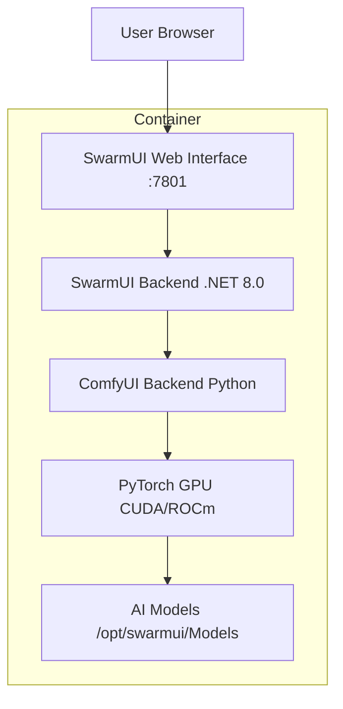

# SwarmUI Implementation Plan

## Overview

**SwarmUI** is a powerful Stable Diffusion WebUI from mcmonkeyprojects that provides:
- Modern web interface for AI image generation
- Built-in ComfyUI integration for standalone operation
- Support for multiple backends (ComfyUI, Automatic1111, etc.)
- .NET 8.0 backend (C#)

**GitHub Repository**: https://github.com/mcmonkeyprojects/SwarmUI

## Configuration Requirements

| Setting | Value |
|---------|-------|
| Mode | Standalone (with built-in ComfyUI) |
| GPU Support | Yes (NVIDIA/AMD) |
| CPU | 4 cores |
| RAM | 8192 MB (8 GB) |
| Disk | 50 GB |
| OS | Debian 13 |
| Port | 7801 (default SwarmUI port) |

## Technical Requirements

### Dependencies
- .NET 8.0 SDK (for building)
- ASP.NET Core 8.0 Runtime (for running)
- Python 3.10+ (for ComfyUI backend)
- Git (for cloning ComfyUI)
- PyTorch with CUDA/ROCm support

### Installation Steps

1. **Install System Dependencies**
   - `libicu-dev`, `libssl-dev` (.NET dependencies)
   - Python 3.11+ with venv

2. **Install .NET 8.0**
   - Use `setup_deb822_repo` for Microsoft repository
   - Install `dotnet-sdk-8.0` and `aspnetcore-runtime-8.0`

3. **Setup Python Environment**
   - Use `setup_uv` with Python 3.11 for ComfyUI

4. **Fetch and Build SwarmUI**
   - Clone from GitHub releases
   - Build with `dotnet build`

5. **Setup ComfyUI Backend**
   - Clone ComfyUI repository
   - Install PyTorch with GPU support
   - Install ComfyUI requirements

6. **Create Systemd Service**
   - Configure for GPU passthrough
   - Set environment variables

7. **Configure GPU Support**
   - Detect GPU type (NVIDIA/AMD)
   - Install appropriate drivers/dependencies

## Files to Create

### 1. `install/swarmui-install.sh`

```bash
#!/usr/bin/env bash
# - Install dependencies (.NET, Python)
# - Fetch SwarmUI from GitHub
# - Build SwarmUI
# - Setup ComfyUI backend
# - Create systemd service
# - Configure for standalone mode
```

### 2. `ct/swarmui.sh`

```bash
#!/usr/bin/env bash
# - Define container variables
# - Update function:
#   - Stop service
#   - Backup data/models
#   - Fetch new release
#   - Rebuild
#   - Restore data
#   - Start service
```

### 3. `frontend/public/json/swarmui.json`

```json
{
  "name": "SwarmUI",
  "slug": "swarmui",
  "categories": [20],  // AI / Coding & Dev-Tools
  "date_created": "2026-03-08",
  "type": "ct",
  "updateable": true,
  "privileged": false,
  "interface_port": 7801,
  "documentation": "https://github.com/mcmonkeyprojects/SwarmUI/blob/master/README.md",
  "website": "https://github.com/mcmonkeyprojects/SwarmUI",
  "logo": "https://raw.githubusercontent.com/mcmonkeyprojects/SwarmUI/master/docs/logo.png",
  "config_path": "/opt/swarmui/Data",
  "description": "SwarmUI is a powerful Stable Diffusion WebUI with built-in ComfyUI integration for AI image generation.",
  "install_methods": [...],
  "default_credentials": { "username": null, "password": null },
  "notes": [...]
}
```

## Key Implementation Details

### GPU Detection and Configuration

The script should detect GPU type and configure accordingly:

```bash
# GPU detection logic
if lspci | grep -qi nvidia; then
    GPU_TYPE="nvidia"
elif lspci | grep -qi amd; then
    GPU_TYPE="amd"
else
    GPU_TYPE="none"
fi
```

### ComfyUI Integration

SwarmUI in standalone mode includes ComfyUI. The installation should:
1. Clone ComfyUI to `/opt/swarmui/dlbackend/comfy`
2. Install PyTorch with appropriate GPU support
3. Configure SwarmUI to use the local ComfyUI backend

### Data Persistence

Important directories to preserve during updates:
- `/opt/swarmui/Data` - User settings, models, outputs
- `/opt/swarmui/Models` - Downloaded AI models (large files)

### Service Configuration

```ini
[Unit]
Description=SwarmUI - Stable Diffusion WebUI
After=network.target

[Service]
Type=simple
User=root
WorkingDirectory=/opt/swarmui
ExecStart=/usr/bin/dotnet /opt/swarmui/SwarmUI.dll
Environment=ASPNETCORE_URLS=http://0.0.0.0:7801
Restart=on-failure
RestartSec=5

[Install]
WantedBy=multi-user.target
```

## Anti-Patterns to Avoid (per AI.md)

1. ❌ **Don't** use Docker
2. ❌ **Don't** wrap `setup_*` functions in msg_info/msg_ok blocks
3. ❌ **Don't** use hardcoded versions - use `fetch_and_deploy_gh_release`
4. ❌ **Don't** create unnecessary variables
5. ❌ **Don't** use `apt-get` - use `apt`
6. ❌ **Don't** list core packages (curl, sudo, wget) as dependencies
7. ❌ **Don't** backup to `/tmp` - use `/opt`
8. ❌ **Don't** use `systemctl daemon-reload` for new services

## Checklist

- [ ] Use `fetch_and_deploy_gh_release` for SwarmUI source
- [ ] Use `setup_uv` for Python/ComfyUI
- [ ] Use `setup_deb822_repo` for Microsoft/.NET repository
- [ ] Use `$STD` for all apt/dotnet commands
- [ ] Include GPU detection and configuration
- [ ] Proper data backup in update function
- [ ] Correct service file with proper environment
- [ ] JSON metadata with all required fields
- [ ] Notes about GPU requirements

## Architecture Diagram



## Update Strategy

1. Check for new release with `check_for_gh_release`
2. Stop SwarmUI service
3. Backup `/opt/swarmui/Data` and `/opt/swarmui/Models`
4. Use `CLEAN_INSTALL=1 fetch_and_deploy_gh_release`
5. Rebuild with `dotnet build`
6. Restore Data and Models
7. Update ComfyUI if needed
8. Start service

## Notes for Users

1. GPU passthrough must be enabled in Proxmox container config
2. NVIDIA requires `nvidia-container-toolkit` on host
3. AMD requires ROCm drivers on host
4. First run will download default models (~5GB)
5. Additional models can be added to `/opt/swarmui/Models`
